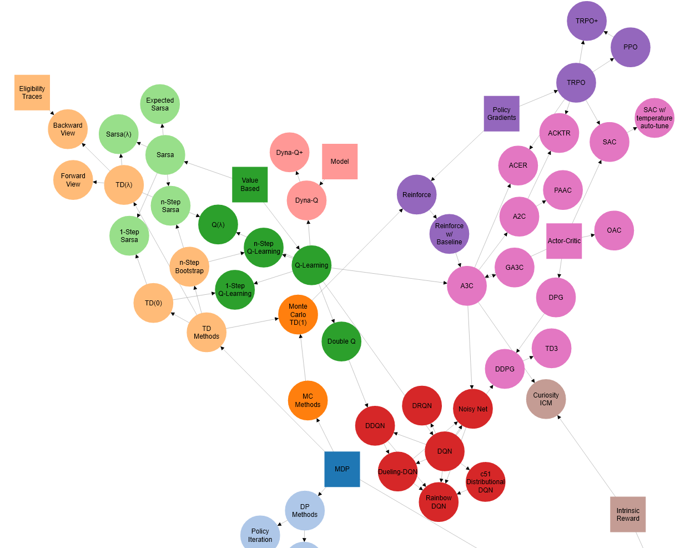

# Directed Graph Visualization

A simple example of creating javascript directed-graph for topic relationship visualization using d3.js (v4).

**Preview**

Click [Here to see the Live Demo][live] of RL algorithm relationships.

[][live]

[live]: https://intuitive-theory.com/assets/html/rl-graph/

**Features**

- Define vertices and edges through json file.
- Organize the graph automatically using force layout.
- Support moving the viewport and zooming in/out.
- Highlight relationships when the mouse enters a vertex.
- Drag vertex to reposition
- Hold down mouse buttons to filter out unrelated vertices.
- Click to log the vertex's name in console.